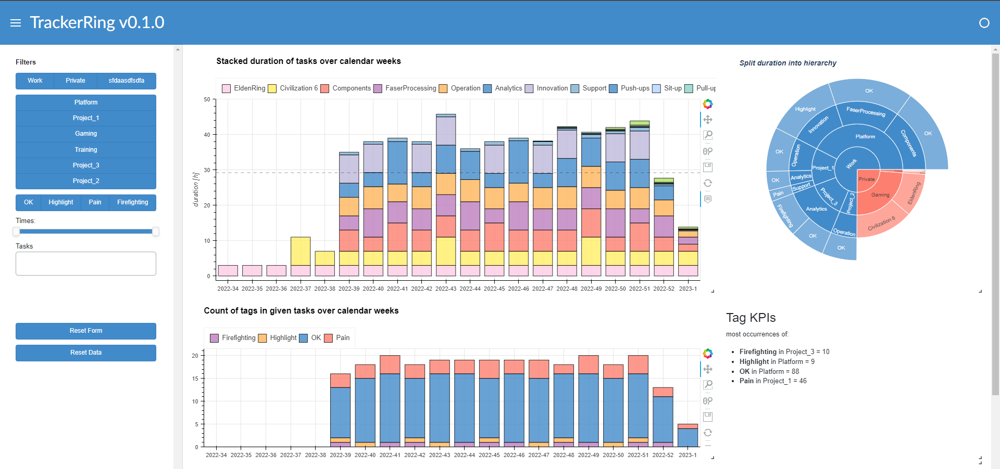
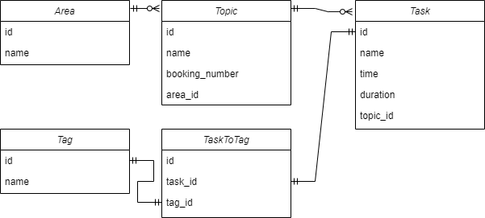

# tracker ring

## Struct

## Open
- [ ] Resolve import struct
  - [ ] init files
  - [ ] caps imports for already init class (param)
- [ ] Doc
  - [ ] Struct
  - [ ] README
- [ ] Logging
- [ ] Commit hooks
- [x] Controller UI elements
  - [x] add area
  - [x] add topic
  - [x] add tasks
  - [x] add tag
  - [ ] update UI element on reload
- [ ] Dashboard
  - [x] Swtich
    - [x] ... between YearWeek or day view
  - [ ] Plots
    - [ ] Heatmap Topic over time
